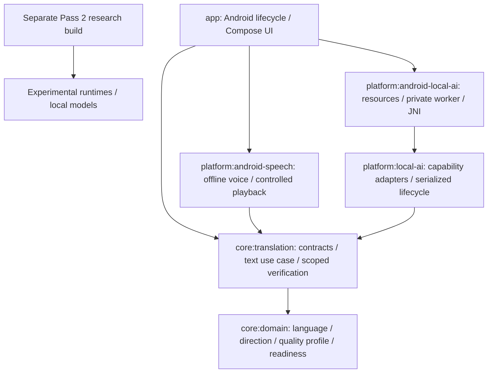

# Architecture

Status: Pass 7 production adapters are physically accepted. Pass 8 composes the real microphone-to-speaker turn around them and the unchanged Pass 6 voice layer. [Product ownership and lifecycle](PASS_8_PRODUCT.md) describes the integration; S25 real-product acceptance remains pending.

## Modules and dependency direction

`:app` owns microphone permission/capture, lifecycle and the shared translator route. Its single launcher opens the product; debug checks remain inside Settings. `LocalCapabilities` supplies neutral recognizer/translator interfaces through constructor composition; the UI never constructs Whisper/MADLAD or calls JNI. The unchanged `:platform:android-speech` implements `SpeechSynthesizer` and `SpeechPlayback`, using installed offline voices, file synthesis and AudioTrack. See [Pass 6](voice/PASS_6_OFFLINE_VOICE_LAYER.md).

`:core:domain` owns readiness, canonical `LanguageId`, ordered `TranslationDirection` and product-only `DeviceQualityProfile`. Its production dependencies are Kotlin stdlib/annotations. `:core:translation` owns the seven suspending capability contracts, immutable request/result/context/quality values, `TranslateTextUseCase`, narrow `ExactIntegerVerifier`, and `ConversationTurnCoordinator` with neutral input/destination/resource ports. It depends only on domain and the already-pinned coroutines library plus stdlib/annotations. No platform, filesystem, HTTP, database, cloud or model dependency enters either core module.

The root has six modules. Normal CI compiles the pinned native runtimes but never downloads/loads weights. Research sources/evidence remain frozen. Both platform adapters keep Android types, JNI, physical files and runtime specifics outside the two pure JVM core modules. See [local resource ownership](LOCAL-AI-ADAPTERS.md) and [locked provenance](LOCAL-AI-PROVENANCE.md).

## Capability inversion and application flow

`SpeechRecognizer`, `Translator`, `SpeechSynthesizer`, `LanguageDetector`, `CriticalContentAnalyzer`, `TranslationVerifier`, and `TranslationNotesAnalyzer` describe product operations. Future adapters implement them and own platform/runtime details. Domain/UI logic does not select model brands, expose tensors/buffers or initialize runtimes. Constructor injection is sufficient; no DI framework, provider registry or automatic implementation selection exists.

The text use case validates input, preflights both selected capabilities, reports/rejects unsupported requirements, translates, validates the candidate, verifies independently and returns `Complete`, `NeedsReview` or `Failed`. Fakes test this flow. The separate Pass 8 audio coordinator uses the accepted production capabilities without invoking this verifier, a notes detector, conversation context or cloud fallback. Translator-supplied verification is cleared before the selected verifier evaluates the candidate.

Capability support is different from evidence about output correctness. Confidence is unavailable by default. Verification PASS is restricted to performed checks; no grammatical-fluency or supported-policy flag proves preserved meaning. See [contracts](TRANSLATION_CONTRACTS.md) and [quality architecture](QUALITY_ARCHITECTURE.md).

## Identity, context and guidance

Language identities use strict BCP-47 syntax with a deliberately bounded two/three-letter base, optional script/region/extensions, and canonical equality. Syntax does not prove registry membership, dialect coverage or engine support. A numeric macroregion is not assumed to be a country. Regional target preference is separate; same-base-language locale rewriting is outside the direction type.

Conversation context is a defensively copied, unmodifiable in-memory recent-history snapshot with explicit turn/character limits. Default is no context. Overflow is rejected rather than silently dropping text. It has no repository/database behavior. Terminology and extensible domain identifiers supply guidance without specialty packs; only GENERAL is predefined. Required hints reject unsupported engines and become verification expectations. Production contains no hard-coded automotive/construction/ranch glossary.

## Offline and cancellation rules

`OFFLINE_REQUIRED` defaults every request. Implementations must reject it before potentially network-capable work when local execution is not guaranteed. The text use case checks **both** capabilities before passing text to either, has no fallback, and rejects forbidden/undeclared actual modes. `ONLINE_ALLOWED` explicitly permits the already-selected implementations; it neither forces network use nor implements routing. Overall execution is online if either stage reports online.

These contracts do not sandbox a dishonest adapter. Release has no Internet permission; the temporary debug downloader alone acquires one pinned resource pack. Inference modules have no network client/fallback and are guarded separately. Suspended operations inherit coroutine cancellation. Blocking native work is reclaimed by terminating the private worker and confirming binder death before admitting another owner. The use case checks activity after each stage; cancellation cannot trigger the next stage. Expected failures are structured, and cancellation remains cancellation.

## Enforced boundaries and remaining product scope

`verifyCoreBoundaries` resolves both production/test runtime graphs against explicit allowlists, rejects unresolved/file dependencies and reversed project edges, and checks source/imports for platform/provider/I/O leakage. Core `check` tasks depend on it; Actions runs it with existing checks. This is a practical dependency/import guard, not arbitrary-code security analysis. JVM lint is build tooling, not an Android runtime dependency in core.

The existing version catalog, Compose BOM, JVM toolchain 17 and formatting mechanism remain. Manifest checks preserve minSdk 26 / targetSdk 36, one launcher, private inference worker and RECORD_AUDIO plus AndroidX's internal signature permission and debug-only model acquisition INTERNET. Release has no camera/network permission. The turn coordinator retains only ephemeral session text; no telemetry, persistent conversation storage or account is added. Low-end-device feasibility remains unproven; profiles do not change this pass's fixed CPU4 configuration.

The [ADRs](DECISIONS/), [privacy constraints](PRIVACY.md), [model policy](MODEL_POLICY.md), historical research receipts and canonical [roadmap](ROADMAP.md) guide future work. Pass 8 is current; no later pass is implemented.
