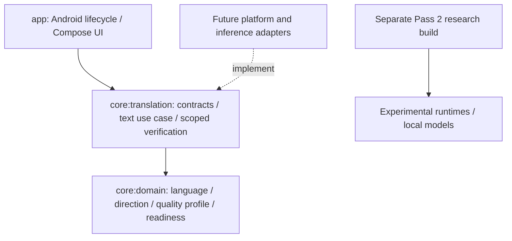

# Architecture

Status: Pass 3 production capability contracts and text orchestration. The Android UI remains the foundation screen with no installed translation engine. Pass 2 inference stays in its independent research build.

## Modules and dependency direction

`:app` owns Android resources/lifecycle and the existing foundation route, ViewModel, immutable state and renderer. It depends on `:core:translation`, which exports domain types. No concrete AI adapter, runtime/model or new UI is installed. `FoundationViewModel` still reports `NOT_INSTALLED` through `StateFlow`; the route uses lifecycle-aware collection. ViewModels hold no Context/Activity. The screen does not invoke the new use case yet.

`:core:domain` owns readiness, canonical `LanguageId`, ordered `TranslationDirection` and product-only `DeviceQualityProfile`. Its production dependencies are Kotlin stdlib/annotations. `:core:translation` owns the seven suspending capability contracts, immutable request/result/context/quality values, `TranslateTextUseCase`, and narrow `ExactIntegerVerifier`. It depends only on domain and the already-pinned coroutines library plus stdlib/annotations. No platform, filesystem, HTTP, database, cloud or model dependency enters either core module.

The root has three meaningful modules. The standalone `spikes/offline-feasibility` build and desktop `tools/offline-feasibility` remain intact and independent; normal CI does not configure their native build or download weights. Existing UI code was not moved and no speculative store/account/adapter modules were created.

## Capability inversion and application flow

`SpeechRecognizer`, `Translator`, `SpeechSynthesizer`, `LanguageDetector`, `CriticalContentAnalyzer`, `TranslationVerifier`, and `TranslationNotesAnalyzer` describe product operations. Future adapters implement them and own platform/runtime details. Domain/UI logic does not select model brands, expose tensors/buffers or initialize runtimes. Constructor injection is sufficient; no DI framework, provider registry or automatic implementation selection exists.

The text use case validates input, preflights both selected capabilities, reports/rejects unsupported requirements, translates, validates the candidate, verifies independently and returns `Complete`, `NeedsReview` or `Failed`. Fakes test this flow. No production audio pipeline, notes detector, context persistence or fallback is invoked. Translator-supplied verification is cleared before the selected verifier evaluates the candidate.

Capability support is different from evidence about output correctness. Confidence is unavailable by default. Verification PASS is restricted to performed checks; no grammatical-fluency or supported-policy flag proves preserved meaning. See [contracts](TRANSLATION_CONTRACTS.md) and [quality architecture](QUALITY_ARCHITECTURE.md).

## Identity, context and guidance

Language identities use strict BCP-47 syntax with a deliberately bounded two/three-letter base, optional script/region/extensions, and canonical equality. Syntax does not prove registry membership, dialect coverage or engine support. A numeric macroregion is not assumed to be a country. Regional target preference is separate; same-base-language locale rewriting is outside the direction type.

Conversation context is a defensively copied, unmodifiable in-memory recent-history snapshot with explicit turn/character limits. Default is no context. Overflow is rejected rather than silently dropping text. It has no repository/database behavior. Terminology and extensible domain identifiers supply guidance without specialty packs; only GENERAL is predefined. Required hints reject unsupported engines and become verification expectations. Production contains no hard-coded automotive/construction/ranch glossary.

## Offline and cancellation rules

`OFFLINE_REQUIRED` defaults every request. Implementations must reject it before potentially network-capable work when local execution is not guaranteed. The text use case checks **both** capabilities before passing text to either, has no fallback, and rejects forbidden/undeclared actual modes. `ONLINE_ALLOWED` explicitly permits the already-selected implementations; it neither forces network use nor implements routing. Overall execution is online if either stage reports online.

These contracts do not sandbox a dishonest adapter. Future implementations need runtime/privacy audits and network-disabled integration tests. Production retains its existing no-Internet manifest. Suspended operations inherit the caller's coroutine context and must release resources cooperatively. The use case checks activity at entry and after each stage; swallowing cancellation cannot trigger the next stage. Expected failures are structured; unexpected programming faults may throw. Coroutine cancellation is not flattened into a normal failure result.

## Enforced boundaries and remaining product scope

`verifyCoreBoundaries` resolves both production/test runtime graphs against explicit allowlists, rejects unresolved/file dependencies and reversed project edges, and checks source/imports for platform/provider/I/O leakage. Core `check` tasks depend on it; Actions runs it with existing checks. This is a practical dependency/import guard, not arbitrary-code security analysis. JVM lint is build tooling, not an Android runtime dependency in core.

The existing version catalog, stable Compose BOM, JVM toolchain 17 and formatting mechanism remain. Manifest checks preserve minSdk 26 / targetSdk 36 and only AndroidX's internal signature permission. No new microphone/camera/network permission, translation input UI, telemetry, conversation storage or account is added. Low-end-phone feasibility remains unproven and quality profiles contain no implementation mapping.

The [ADRs](DECISIONS/), [privacy constraints](PRIVACY.md), [model policy](MODEL_POLICY.md) and preserved [Pass 2 findings](feasibility/PASS_2_OFFLINE_FEASIBILITY.md) guide future work. Pass 4 experimentation has not begun.
