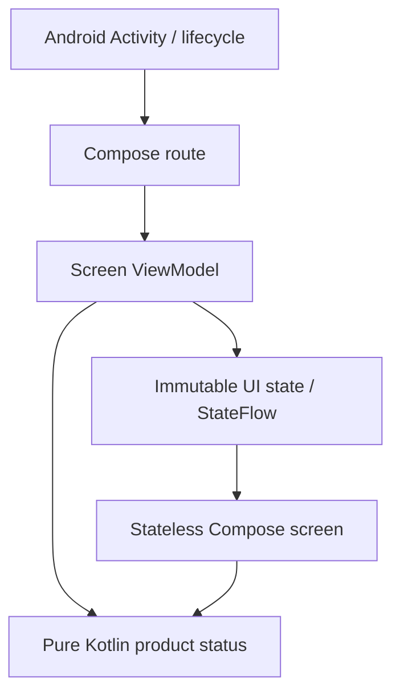

# Architecture

Status: Pass 1 native Android foundation. Translation and AI capability interfaces are absent.

## Current boundaries



`:app` owns Android resources, lifecycle, UI, and later Android adapters. Its `platform` package contains `MainActivity`; `ui/foundation` contains the route, ViewModel, state, and renderer; `ui/theme` contains the Material 3 theme. `:core:domain` owns the provider-independent `TranslationAvailability` product status. It depends only on Kotlin's standard library in production, with JUnit for tests.

The module dependency direction is `:app -> :core:domain`. Domain code must not import Android, Compose, platform APIs, cloud clients, or model/runtime libraries. No Kotlin Multiplatform or iOS module is added. Keeping concepts free of Android makes later reuse or porting practical without prematurely committing to a sharing technology.

## UI and state

`FoundationViewModel` owns a private `MutableStateFlow` and exposes `StateFlow<FoundationUiState>` through `asStateFlow()`. The state is immutable, and it honestly reports an absent engine. The route observes it with `collectAsStateWithLifecycle`; the stateless screen only renders values/resources. ViewModels must not hold a `Context` or `Activity`.

The current screen has no user actions or changing capabilities. There is no artificial refresh button, simulated engine, event bus, or repository. When real actions exist, events flow from the UI to its ViewModel/application capability; state flows back to the UI. Business decisions belong below composables. Constructors and normal ViewModel creation are sufficient today; a DI framework is deferred until a concrete need exists.

## Required future dependency direction

```text
UI -> application/domain capability -> AI capability interface -> replaceable implementation
```

This is a future boundary, not code implemented in Pass 1. Application/domain capabilities describe product needs; model and platform adapters implement them. Models such as a particular translator or speech recognizer must never become fundamental domain types. UI code must not import a model, invoke a runtime, or select a cloud provider directly. Interfaces belong to Pass 2, with implementation/model investigation only as separately authorized.

Inversion around platform/model capabilities allows implementations to be replaced and enables domain/application tests to use small fakes rather than load large models. Future persistence likewise belongs behind abstractions; no database or storage interface is needed today.

## Product constraints

- After required future language/model packs are installed, core translation must work with no network connection.
- Offline translation must never transmit user speech/text off-device. Any optional cloud feature must be separate and deliberately selected. Silent cloud fallback is forbidden.
- Conversation content must be ephemeral by default. A future retention/export feature requires an explicit decision, clear user choice, and storage abstractions.
- The initial product architecture has no mandatory Common Tongue account. An offline engine must not wait for authentication or a backend to start.
- Low-end Android phones are a first-class concern. Avoid large startup allocations, mandatory model initialization, or assumptions about CPU/GPU/NPU support.
- `Lite`, `Standard`, and `Enhanced` are eventual device-quality concepts only. Different phones may use different implementations. No profiling, benchmarking, tier selection, or tier execution exists now.
- Android is the only platform in this pass. A later native iPhone UI must be able to depend on product concepts without inheriting Android lifecycle types.

## Enforced foundation guardrails

Exactly two meaningful modules exist. Dependency versions use one catalog and stable Compose BOM. Debug and unsigned optimized release build types are separate. Android lint and one formatting mechanism run locally and in CI. Unit tests do not initialize Android or models; the Compose smoke test launches the actual Activity on a device.

The merged-manifest verification checks both build types, enforces minSdk 26 / targetSdk 36, and allows only AndroidX's app-scoped signature permission for internal receiver protection. No Internet, microphone, camera, analytics, SaaS, accounts, or databases are present. Future permission/dependency changes require an explicitly scoped pass and renewed manifest inspection.

The five [ADRs](DECISIONS/) record the foundational decisions. [Model policy](MODEL_POLICY.md) governs future adoption; no model has been approved.
