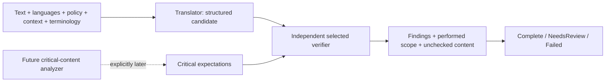

# Meaning and translation quality architecture

Pass 2's grammatical outputs sometimes omitted clauses or corrupted jack/safety/technical meanings. Pass 3 separates candidate generation, evidence about meaning and optional interpretation notes. It does not improve or approve a model's measured quality.

## Distinct evidence and outcomes

Capability support describes whether a request can be honored, not whether an output is correct. ASR confidence concerns recognized input, not translation fidelity. Verification PASS means the performed checks passed within their scope. Notes describe interpretations; possible sarcasm does not assert speaker intent. Severity is potential impact, certainty is evidence.

VerificationReport statuses are PASS, PASS_WITH_WARNINGS, NEEDS_REVIEW, FAIL. PASS requires nonempty performed checks, no findings/unchecked kinds. PASS_WITH_WARNINGS requires findings but excludes critical findings/unchecked kinds. The use case cross-checks scope against supplied expectations and routes critical warnings to review. A scoped pass must never become universal meaning approval in a future UI.

Translator-supplied verification cannot bypass the selected verifier. Operational inability to run a verifier differs from a check returning FAIL. Candidates/findings survive review/failure without implying storage or automatic speech output. Semantic analysis is a replaceable contract, not an implemented NLP detector.

## Critical expectations

| Content | Representation / remaining work |
| --- | --- |
| Numbers | Explicit digit-written NumericValue with exact decimal normalization and multiplicity. Written-out numbers need semantic interpretation. |
| Currency | Exact amount plus uppercase three-letter CurrencyCode; no registry/symbol disambiguation. |
| Measurements | Exact amount plus extensible UnitId; conversion/dimension/locale abbreviations need a capable verifier. |
| Dates/times | Immutable LocalDate/LocalTime; no language/time-zone interpretation. |
| Negation | Source excerpt; no universal “not/no” detection regex. |
| Names | Proper-name source text; no universal string equality/transliteration detector. |
| Safety/prohibition | Explicit intent excerpt; requires semantic evidence. |
| Terminology | Supplied term/meaning/domain/strength; required hints are added by the use case. |

CriticalContentAnalyzer identifies expectations and unchecked kinds later. NumericValue accepts bounded ASCII signed decimal values, normalizes scale/leading zeros exactly, and rejects localized commas, exponents, NaN and display strings. The value types do not prove their textual source/target interpretation. No glossary or model-specific prompt is hard-coded.

## Implemented deterministic guard

ExactIntegerVerifier compares **explicit complete multisets of standalone ASCII integer digit values** in source/target. Reordering is allowed; sign/leading zeros/integer scale normalize by value. Changed values, missing repetitions and extra target digits affect the multiset. Performed scope is EXACT_INTEGER_LITERALS.

- PASS: expected values exactly cover source literals and target value/count multiset matches, with no other requested content unchecked.
- FAIL: target digit-written values/counts differ within this scope. The critical observed finding is about literal preservation, not all possible semantic interpretations.
- NEEDS_REVIEW: no expectations, incomplete/inconsistent source coverage, written-out target numbers, decimal/grouped/date/time/range/embedded formats, non-ASCII digits or unsupported requested semantic content. No-digits is never a vacuous pass.
- Structured input failures: blank input or configurable length overflow (default 16,000 characters).

12/3 bolts-and-nuts reordered in target passes the integer check. 12→13 or dropping a repeated 12 fails it. 12→doce, 12.5, 1,000, 1 000, 15:30, date notation and M12 require review. Matching numbers do **not** prove a negated/prohibited instruction survived; those expectations remain unchecked. No automatic back-translation, LLM, sarcasm analysis or semantic scoring exists. Further decimal/structured checks need unambiguous source/target annotations and their own evidence/tests.

## Future benchmark specification

[Pass 2's corpus/results](feasibility/BENCHMARK_RESULTS.md) remain unchanged historical evidence. No new bake-off or automated semantic score occurs here. Future quality passes should version the protocol separately and score each direction/region/domain/stage.

For each case retain source/category, context window, terminology/policy/region requests, critical expected facts, reference/recognized transcript, candidate text, TTS identity/audio, verifier scope/findings, reviewer fluency/role and rationale. Compare translation of correct text with translation of ASR output to isolate propagated ASR errors. Preserve historical outputs.

Suggested per-dimension review rubric: **2 preserved**, **1 partial/uncertain**, **0 material failure**, **N/A absent**, **UNREVIEWED no reviewer/evidence**. Do not turn missing review into a passing score or average away critical number/negation/safety failures; report those separately as blockers.

| Dimension | Future review |
| --- | --- |
| Meaning | Propositions, intent, speaker/person/modal changes and relationships survive. |
| Terminology | Intended technical sense and supplied hints survive. |
| Idioms/slang | Meaning/tone survive without literal distortion or profanity sanitizing. |
| Context | Recent turns resolve references without inventing information; compare enabled/disabled context. |
| Regional language | Intended target variety and casual/regional source expressions. |
| Numbers/currency | Values/counts/conventions/currency identity; report narrow deterministic evidence separately. |
| Units | Amount/dimension/unit; conversions only when explicitly allowed and correct. |
| Negation/safety | Polarity/scope/prohibition/until-before conditions; no universal keyword claim. |
| Omitted clauses | Every meaningful source clause remains accounted for. |
| Invented information | No unsupported facts/actions/specificity; uncertainty remains visible. |
| Naturalness/tone | Fluent phrasing/social tone, assessed separately from correctness. |

Attribute **ASR error** to reference→recognized source; **translation error** to correct source→incorrect target; **verification failure** to missed bad output/false alarm/incomplete check/operational failure; **TTS error** to wrong language/voice or unusable audio despite acceptable text. Mixed causes may coexist. A warning is not automatically a confirmed error; verifier PASS is not human approval.

This rubric is documentation, not an implemented automatic scorer. Native/fluent review, concrete detectors/adapters, phone profiling and better-model experimentation await later authorization.
