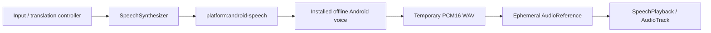

# Pass 6: production offline Android voice layer

Status: production adapter implemented; local/CI checks and **new S25 acceptance are recorded separately**. Pass 5 is accepted at `5ee45413e3c72493ae3f13ec6f913728828a3e0f`. Its successful v7 research run is the reason for choosing this path, not evidence that the new adapter has already passed a physical trial. Do not close Pass 6 without the new EN/ES results and human audibility confirmation. Do not begin Pass 7.

## Implementation

`:platform:android-speech` implements the existing `SpeechSynthesizer` capability. The only core addition is platform-neutral `SpeechPlayback` and its playback receipt. Translation/business code continues to use language, voice and audio identities rather than Android objects, files, buffers or engine packages. A future iOS adapter can implement these interfaces using `AVSpeechSynthesizer` and local audio playback. This pass implements neither iOS nor touchless input. `cancel()` can be called by any future input/translation controller; there is no PTT dependency.

`synthesize()` returns an in-memory, session-local audio handle. `play()` plays that handle and waits for completion. Repeating `play()` replays without sending text to the engine again. The adapter retains one latest PCM buffer, bounded by a 32 MiB WAV limit; a successful replacement revokes the previous handle and clears its buffer. Explicit release/close clears audio. The temporary app-private cache WAV is deleted after synthesis, including normal errors/cancellation; orphaned WAVs older than an hour are removed on subsequent synthesis. Abrupt process termination can prevent immediate deletion. No conversation database or persistent replay is introduced.

The preserved route is **synthesize-to-file → strict PCM16 WAV parsing → static AudioTrack**. Mono/stereo, 8–48 kHz, PCM16, chunk bounds/padding, block alignment and non-silent signal are validated. Direct `speak()` is not used or benchmarked in this pass. Playback success requires frame advancement past the first non-silent sample and completion, not an enqueue return value. Latency derives from observed playback-head position plus a PCM amplitude threshold; it is an estimate, not calibrated acoustic evidence.

## Engine and voice policy

Engine discovery uses the standard TTS engine list and Android TTS service query, including a package-manager discovery fallback if initialization of the default engine fails. Engines are initialized without supplying user text. No Google/Samsung allowlist exists. Voice selection considers only installed voices with `isNetworkConnectionRequired == false` and without the not-installed feature. An explicit `VoiceId` must match the requested language and an available offline voice. Opaque voice IDs include provider identity; they do not expose a filename or locale assumption.

Explicit requested regions rank first. Generic English prefers en-US. Spanish prefers es-419/Mexican/other Latin American variants, with es-US accepted as a suitable fallback. Regional suitability takes precedence over the user's preferred engine; among equally suitable voices that engine ranks first, followed by quality/latency and stable identifiers. es-ES is a usable offline fallback if no suitable regional voice is available. Returned `languageUsed` records the actual selected locale; syntax/ranking does not certify accent quality.

Before text is submitted, the driver checks language availability, reapplies the offline voice after `setLanguage`, and reads back its name/locale/network/installation flags. It supplies the embedded-synthesis flag and checks speech-rate/queue/listener return values. Unknown preferences, speaker preservation, unsupported rates, empty input, excessive input, missing voice, failed synthesis, invalid audio and unavailable focus produce structured capability failures with static messages. Both `OFFLINE_REQUIRED` and `ONLINE_ALLOWED` use this same offline path; the adapter never routes to cloud synthesis. There is no airplane-mode check in the production adapter.

Android's public explicit-engine constructor may fall back to another installed engine. Diagnostic `engine` denotes the requested package, not independently authenticated service binding; actual voice flags are read from the connected instance and verified before synthesis. No hidden API/reflection is used to claim stronger provider identity. The installed engine is an external app: selecting its declared offline voice does not sandbox a dishonest provider or prove all operating-system/vendor network traffic absent. Phone offline proof and trusted installed engines remain relevant.

## Replacement, focus, routing and lifecycle

All state is confined to the main dispatcher. New synthesis/play requests cancel older work. A mutex covers engine work **and its cancellation cleanup**, so a sequence of cancelled waiters cannot allow overlap. Engine callbacks are correlated to random request IDs; stale completion/error callbacks cannot complete a new request. Coroutine cancellation propagates to callers instead of masquerading as successful synthesis.

Controlled playback requests transient audio focus using media/speech attributes. Denied focus fails immediately. Any focus loss, including ducking, stops speech; it does not unexpectedly resume or compete with a phone call. Focus is abandoned and AudioTrack released in all exit paths. Audio follows Android's selected media output without forcing speaker, SCO or a particular Bluetooth device. Becoming-noisy/headset-to-speaker route changes stop playback. Old focus/route callbacks are generation-checked. There is no Bluetooth permission or hidden device identifier in diagnostics.

The owner must call `setForeground(true)` while visible and `setForeground(false)` when leaving. Backgrounding cancels work and shuts down all TTS instances; replay PCM remains available for the visible session on return. `close()` is idempotent and revokes all handles. No foreground service, background conversation or hands-free controller is added. The debug trial Activity supplies this lifecycle ownership; the foundation UI and uninstalled translation status remain intact.

## Privacy and diagnostics

Common Tongue retains no INTERNET permission, network client, telemetry or microphone permission in this build. The sole manifest addition is the TTS service-discovery query. Typed bounded diagnostics record initialization duration/result, requested engine, selected voice/locale/network flag, synthesis completion/error/duration, frame advancement, output device **type**, and synthesis-request/play-request latency. Unsafe provider identifiers are hashed. No raw text/audio, file paths, device addresses, utterance IDs or exception messages are logged/exported. Instrumentation/test phrases are fixed public controls. A diagnostic sink failure cannot break speech.

Vendor voice downloads/settings occur in the vendor's installed engine or phone settings, outside Common Tongue. Common Tongue neither downloads nor redistributes voices. See the [first-party licensing/provenance review](LICENSING_PROVENANCE.md), which keeps invocation, output rights, asset distribution, attribution and network dependencies separate.

## Validation and physical acceptance

Model-free JVM coverage exercises provider-neutral regional ranking, rejection of network/uninstalled voices and unsupported preferences, malformed WAVs, replay/revocation, privacy, foreground/background cleanup, caller cancellation, repeated replacements with delayed cleanup, playback replacement and structured focus/route failures. A compiled Android instrumentation integration test uses the actual contract/adapter/installed voices for EN/ES and replay, with observed playback frames. It explicitly skips when no suitable voices exist; a skip/build is not a physical pass.

The debug-only **Common Tongue Voice Check** launcher uses the production module, fixed EN/ES controls, playback/replay, missing-language/speaker-preference failures, rapid replacement and JSON export. It installs as `com.commontongue.prototype.debug`, separately from `com.commontongue.spike.device`. No pack/model/microphone is needed and the accepted Pass 5 app/data remain intact. The CI artifact contains its APK, SHA-256, requirements and plain-English setup instructions. A repository-associated research prerelease can provide a direct phone download; it is not a consumer production release.

The S25 tester has **phone speaker only**. Record new EN/ES playback with radios enabled, human audibility, replay, stop/replacement and return-from-background behavior. Optionally repeat in airplane mode as offline proof. Headphone/Bluetooth physical behavior remains untested until hardware is available; fakes and routing code are not a substitute. New exported results are required before claiming S25 acceptance. `tools/voice-layer/verify-baseline.py` checks all 285 recorded research/model/native inputs against the accepted Pass 5 inventory; Whisper, MADLAD, model assets and native translation source are unchanged.

## Remaining concerns before consumer release

Pre-release legal review must settle provider-specific commercial invocation/output rights and applicable regional/device EULAs. Additional physical output-device coverage is needed. Low-end-phone and long-session performance, complete production translation wiring, production signing/application identity, iOS and touchless mode remain outside this pass. No new bundled neural TTS model is justified by the accepted system-voice evidence.
